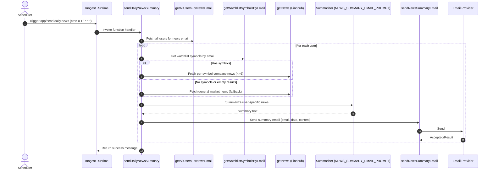
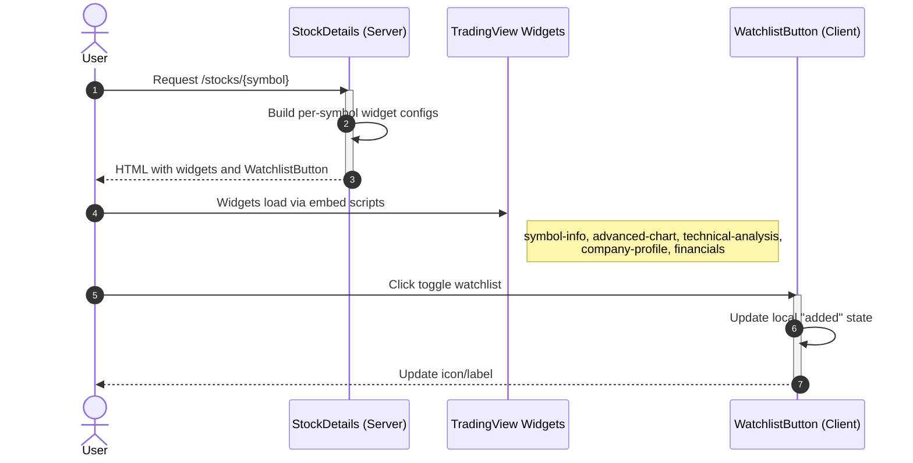

# 📈 Signalist Stock Tracker

A modern, full-stack stock tracking application built with Next.js 15, featuring real-time market data, personalized watchlists, AI-powered insights, and automated email notifications. Track your favorite stocks with professional-grade charts, technical analysis, and market news.


## 🚀 Features

### 📊 **Real-Time Market Dashboard**
- **TradingView Widgets**: Professional-grade market overview, heatmaps, and news timeline
- **Live Stock Quotes**: Real-time pricing data with percentage changes
- **Market Analytics**: S&P 500 heatmap by market cap and performance
- **Technical Analysis**: Buy/sell signals and advanced charting tools

### 🔍 **Advanced Stock Search & Discovery**
- **Smart Search**: Debounced search with real-time suggestions via Finnhub API
- **Company Profiles**: Detailed business information, market cap, and key metrics
- **Stock Details**: Individual pages with comprehensive analysis and charts
- **Popular Stocks**: Curated list of trending and popular securities

### 📝 **Personal Watchlist Management**
- **Custom Watchlists**: Add/remove stocks with instant updates
- **Pagination**: Efficient handling of large watchlists
- **Search & Filter**: Find specific stocks within your watchlist

### 🤖 **AI-Powered Insights**
- **Gemini AI Integration**: Intelligent market analysis and personalized insights
- **News Summaries**: AI-generated daily market summaries based on your watchlist
- **Personalized Content**: Investment recommendations tailored to your profile

### 📧 **Automated Notifications**
- **Welcome Emails**: Personalized onboarding experience
- **Daily News Digest**: Automated email summaries of market news
- **Custom Scheduling**: Background jobs with Inngest for reliable delivery

### 🔐 **Secure Authentication**
- **Better-Auth Integration**: Secure session management with MongoDB
- **User Profiles**: Investment goals, risk tolerance, and preferences
- **Protected Routes**: Middleware-based authentication for all features

## 🛠️ Tech Stack

### **Frontend**
- **Framework**: Next.js 15.5.2 with App Router
- **UI Library**: React 19.1.0 + Tailwind CSS 4
- **Components**: Radix UI primitives with custom styling
- **Icons**: Heroicons + Lucide React
- **State Management**: React hooks + Server Actions

### **Backend**
- **Runtime**: Node.js with TypeScript
- **Database**: MongoDB with Mongoose ODM
- **Authentication**: Better-Auth with MongoDB adapter
- **Background Jobs**: Inngest with AI integration
- **Email Service**: Nodemailer with Gmail SMTP

### **API Integrations**
- **Market Data**: Finnhub API for real-time quotes and company information
- **Charts & Widgets**: TradingView embedding for professional analysis
- **AI Processing**: Google Gemini API for intelligent content generation
- **News Feed**: Automated news aggregation and summarization

## 🏗️ Architecture

### Sequence Diagram



### **Data Flow**
1. **User Authentication**: Better-Auth handles secure login/registration
2. **Market Data**: Finnhub API provides real-time stock information
3. **Watchlist Management**: MongoDB stores user preferences and selections
4. **Background Processing**: Inngest handles automated emails and AI tasks
5. **Real-Time Updates**: Server actions with optimistic UI updates

### **Key Components**
- **SearchCommand**: Debounced stock search with autocomplete
- **TradingViewWidget**: Memoized widget renderer for charts and analysis
- **WatchlistTable**: Paginated table with real-time data updates
- **Header & Navigation**: Centralized navigation with user management

## 🔧 Setup & Installation

### **Prerequisites**
- Node.js 18+ 
- MongoDB database
- Finnhub API key
- Google Gemini API key
- Gmail account for email service

### **Environment Variables**
Create a `.env.local` file with the following variables:

```bash
# Database
MONGODB_URI=mongodb://localhost:27017/signalist

# Authentication
BETTER_AUTH_SECRET=your-secret-key-here
BETTER_AUTH_URL=http://localhost:3000

# Market Data APIs
FINNHUB_API_KEY=your-finnhub-api-key
NEXT_PUBLIC_FINNHUB_API_KEY=your-finnhub-api-key

# AI Integration
GEMINI_API_KEY=your-gemini-api-key

# Email Service
NODEMAILER_EMAIL=your-gmail@gmail.com
NODEMAILER_PASSWORD=your-app-password

# Background Jobs
INNGEST_EVENT_KEY=your-inngest-event-key
INNGEST_SIGNING_KEY=your-inngest-signing-key
```

### **Installation Steps**

1. **Clone the repository**
   ```bash
   git clone <repository-url>
   cd signalist_stock-tracker-app
   ```

2. **Install dependencies**
   ```bash
   npm install
   ```

3. **Set up environment variables**
   ```bash
   cp .env.example .env.local
   # Fill in your API keys and configuration
   ```

4. **Start the development server**
   ```bash
   npm run dev
   ```

5. **Open your browser**
   Navigate to `http://localhost:3000`

### **Database Setup**
The application automatically connects to MongoDB using Mongoose. Ensure your MongoDB instance is running and accessible via the `MONGODB_URI` connection string.

## 📱 API Endpoints

### **Finnhub Integration**
- `/quote` - Real-time stock quotes
- `/search` - Stock symbol search
- `/company-profile2` - Company information
- `/company-news` - Stock-specific news
- `/news` - General market news

### **Internal APIs**
- `/api/inngest` - Webhook endpoint for background jobs
- Server Actions for watchlist management and user operations

## 🔄 Background Jobs

### **Welcome Email Automation**
- Triggered on user registration
- Generates personalized welcome content using Gemini AI
- Sends HTML email with investment guidance

### **Daily News Summaries**
- Scheduled daily at 12 PM
- Fetches news for user watchlist stocks
- AI-powered summarization and email delivery
- Personalized content based on user preferences

## 🎨 UI/UX Features

### **Dark Mode Optimized**
- Consistent dark theme across all components
- TradingView widgets styled for dark backgrounds
- Professional financial application aesthetic

### **Responsive Design**
- Mobile-first approach with Tailwind CSS
- Optimized for desktop and mobile viewing
- Adaptive layouts for different screen sizes

### **Performance Optimizations**
- Next.js Image optimization
- Component memoization for complex widgets
- API response caching with appropriate TTL
- Debounced search to minimize API calls

## 🔐 Security Features

- **Session Management**: Secure cookie-based sessions with Better-Auth
- **Route Protection**: Middleware-based authentication for all protected routes
- **Input Validation**: Server-side validation for all user inputs
- **API Rate Limiting**: Cached responses to prevent API abuse
- **Environment Security**: Sensitive data stored in environment variables

## 📧 Email Templates

### **Welcome Email**
- Personalized greeting with user's name
- Investment guidance based on user profile
- Introduction to platform features
- AI-generated content for engagement

### **Daily News Summary**
- Market overview and key highlights
- News specific to user's watchlist
- AI-summarized content for quick reading
- Professional newsletter format

## 🚀 Deployment

### **Vercel Deployment** (Recommended)
1. Connect your repository to Vercel
2. Configure environment variables in Vercel dashboard
3. Deploy with automatic builds on git push

### **Environment Configuration**
Ensure all environment variables are properly set in your production environment, including:
- Database connection strings
- API keys for all external services
- Email service credentials
- Background job authentication

## 🤝 Contributing

1. Fork the repository
2. Create a feature branch (`git checkout -b feature/amazing-feature`)
3. Commit your changes (`git commit -m 'Add amazing feature'`)
4. Push to the branch (`git push origin feature/amazing-feature`)
5. Open a Pull Request

## 📄 License

This project is licensed under the MIT License - see the [LICENSE](LICENSE) file for details.

## 🙏 Acknowledgments

- **Finnhub** for providing comprehensive market data APIs
- **TradingView** for professional-grade charting widgets
- **Google Gemini** for AI-powered content generation
- **Better-Auth** for secure authentication infrastructure
- **Inngest** for reliable background job processing

---

**Built with ❤️ for the financial technology community**
